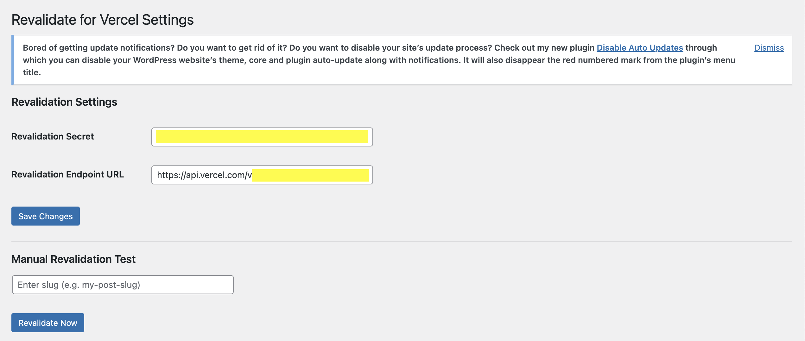
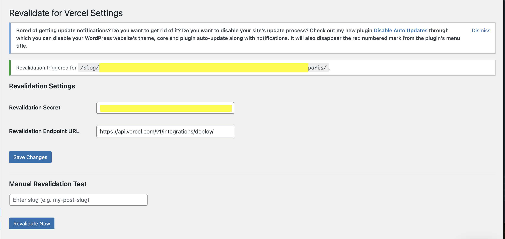
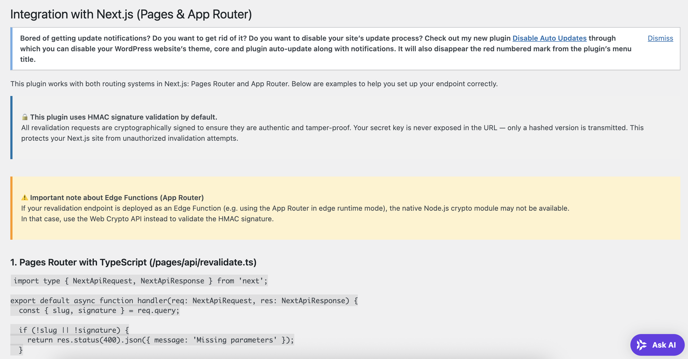
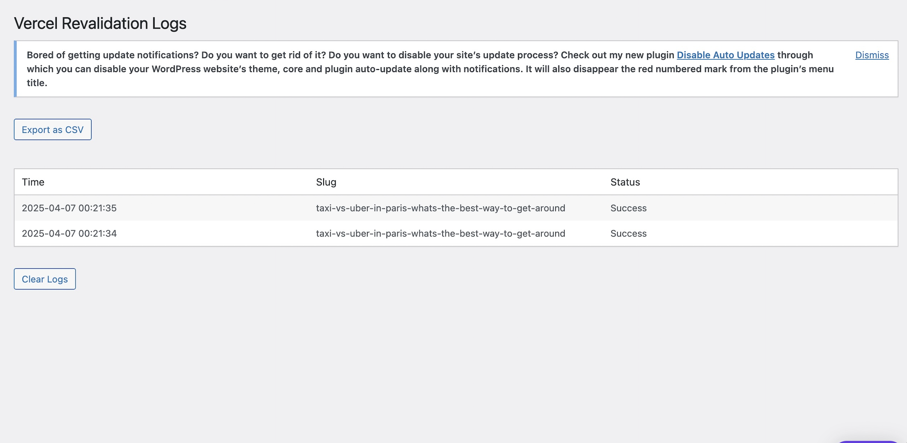

# Revalidate for Vercel – WordPress Plugin for Next.js ISR

Trigger ISR (Incremental Static Regeneration) from WordPress to Vercel on post update. Built for headless WordPress + Next.js.
This plugin is not affiliated with Vercel.

---

## 🔥 Features

- ✅ Automatic revalidation on post publish/update
- ✅ Secure HMAC signature verification by default
- ✅ Compatible with **Next.js Pages Router & App Router**
- ✅ Works with both JavaScript and TypeScript APIs
- ✅ Manual revalidation interface
- ✅ Admin logs with status, date, and export
- ✅ Language support: English 🇺🇸 / French 🇫🇷
- ✅ Clean, modern admin UI (SVG icon included)

---

## 🛠 Installation

1. Upload the plugin folder to `/wp-content/plugins/revalidate-for-vercel`
2. Activate via the WordPress admin
3. Go to `Settings > Revalidate for Vercel`
4. Enter your revalidation endpoint and shared secret
5. Ensure your Next.js app has a secure `/api/revalidate` endpoint (see Help tab)

---

## 📘 Documentation

Find examples for:
- Pages Router (JS & TS)
- App Router (JS & TS)

All included in the plugin's **Help & Integration** tab 🧩

---

## 🖼️ Screenshots

### 1. Plugin Settings

### 2. Plugin Settings after triggering a manual refresh using a slug

### 3. Help & Integration Tab

### 4. Revalidation Logs

---

## 🛡️ Security

This plugin does not send secrets in plain text. Every request is signed with HMAC-SHA256 using your shared key. Unauthorized requests are automatically rejected.

---

## 🧾 Changelog

See [CHANGELOG.md](./CHANGELOG.md) for full release history.

Latest: **v1.5**
- 🔒 WP_Filesystem export refactor
- 🛠️ GitHub Actions release flow with auto-zip
- 🧼 Clean build without DS_Store or build-release.sh

---

## 💼 Pro Version (Coming Soon)

The Pro version will include:
- Analytics Dashboard (charts & trends)
- Slack/webhook alerts
- Monthly email reports
- Extended logs + filtering
- License manager

Stay tuned!

---

## 📜 License

This plugin is licensed under the GPLv2 or later.

